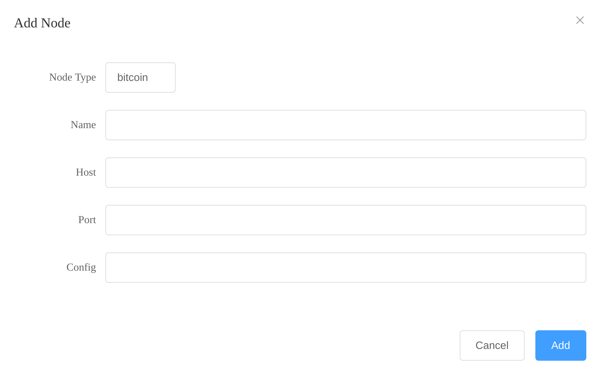
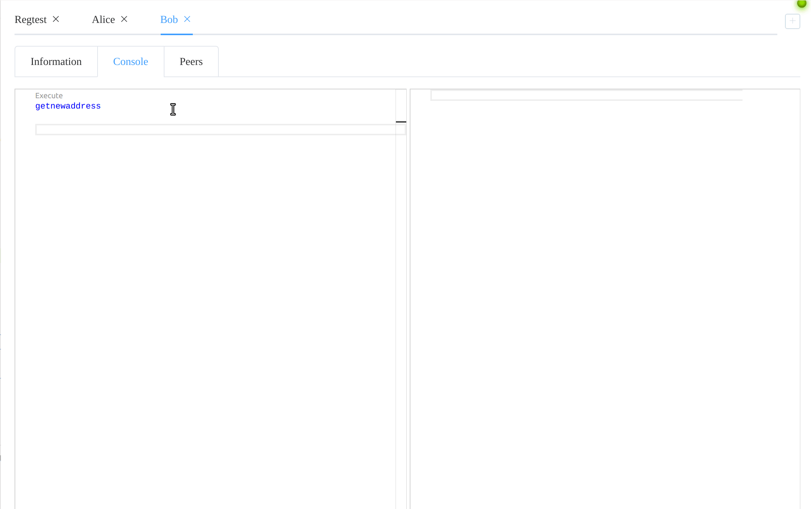
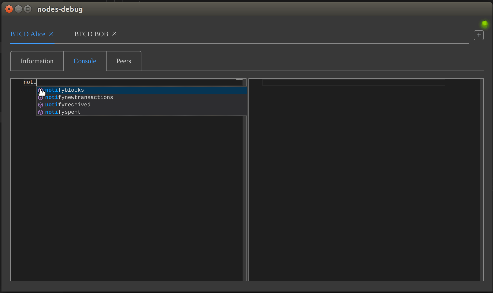

# nodes-debug

## Description

This is intended to be a general purpose tool to aid in the development of bitcoin or other similar applications(currently only bitcoin core and btcd supported).

It provides a way to interact with multiple rpc nodes.  

The integrated console lets you talk to multiple nodes from a single interface, the commands feature code completion, signature help, syntax highlighting and folding.  Also, help is provided on hover for all commands.  Command results provide folding for better focus and insertion of result parameters into successive commands.

The project is designed such that multiple node types can be added in the future.

#### Build Setup

``` bash
# install dependencies
npm install

# build node types
# FROM .nodetypes DIRECTORY
node index.js

# serve with hot reload at localhost:9080
npm run dev

# build electron application for production
npm run build

# run unit & end-to-end tests
npm test


```

## Usage

### Configuring Nodes

Nodes are configured via the UI and can be saved and retrieved for running multiple configurations.  The configurations are saved as JSON so nodes can be manually configured also if desired.  When the app starts, it will load last loaded configuration automatically.

#### Create nodes using the UI

To add a node to the current configuration, click the + icon to the upper right of the interface.  A dialog will appear



All parameters are optional, defaults will be used, **Name** is recommended as it appears in the tab, also **port**(or **config** if `rpcport` is set there) since the default is mainnet

* **Node Type**: The type of the node (bitcoin/btcd/third party)
* **Name**: What you want to call it, this will appear it it's tab
* **Host**: Node's IP address
* **Port**: The RPC port of the node
* **Config**: Path to configuration file, this is where the node's RPC authentication information is located in format of standard `bitcoin.conf`(or btcd.conf or format of third party's choosing)

After one or more nodes are added, you can save the configuration by selecting form the menu `Config -> Save`

#### Manually creating
Saving from the UI will create a JSON file like this, you can create manually and load rather than using the UI if preferred.

``` JSON
[
   {
      "name": "Alice",
      "type": "bitcoin",
      "port": "18654",
      "host": "127.0.0.1",
      "config": "~/regtest/alice/bitcoin.conf",
      "index": "n1521588alice"
   },
   {
      "name": "Bob",
      "type": "bitcoin",
      "port": "18554",
      "host": "127.0.0.1",
      "config": "~/regtest/bob/bitcoin.conf",
      "index": "n15bob"
   }
]
```

The index must be unique, the UI will use the timestamp but this can be anything.

To load saved or manually created configuration, from the menu choose `Config -> Load`

### Using the console

Commands are entered in the left pane and when executed results display in the right.

For the default node type of 'bitcion', a single command may be multi line. Leave whitespace for argument separation, JSON objects are parsed as a single argument.

example:

```
addmultisigaddress 2
[
    "key1",
    "key2"
]
```

### Features example, light theme


Commands are executed by pressing F5, pressing the codelens helper or from the context menu.

### Notification dark theme (BTCD)



# Development

This utility supports multiple node types.  It ships with `bitcoin`(bitcoin core) and `btcd`.  The node types are defined in the `.nodetypes` directory.  To create a node of a different type, follow the example in the `bitcoin` directory.  The `${your_node_type}Controller.js` file needs to implement the methods that do not begin with an underscore.  For questions please contact me directly.

# Disclaimer
This is meant as a development tool and suggested to use on testnet or regtest, use on mainnet at your own risk.

---

This project was generated with [electron-vue](https://github.com/SimulatedGREG/electron-vue) using [vue-cli](https://github.com/vuejs/vue-cli). Documentation about the original structure can be found [here](https://simulatedgreg.gitbooks.io/electron-vue/content/index.html).
